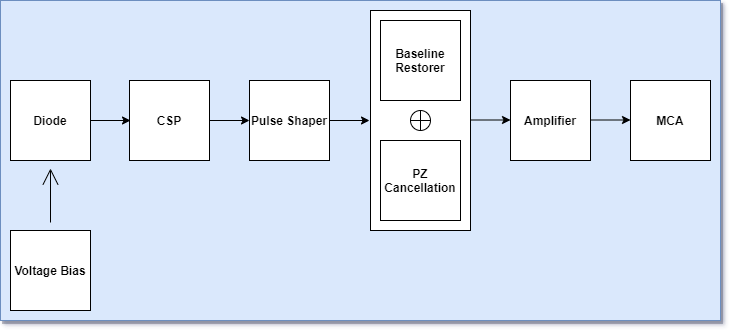

# GLEE
## Spectroscopy Payload
**Aim -** To validate the presence of minerals in the lunar regolith through gamma ray or x-ray spectroscopy.

**Tasks:**
- Designing a capable spectroscopy system
- Testing the precision of spectral lines
- Modelling known sources of radiation and their spectrum
- Data analysis and inference
### Circuit Design

The Circuit Consists of the following parts-
- Diode Sensor & Voltage Bias
- Charge Sensitive Preamplifier
- Pulse Shaper Circuit
- Baseline Restorer & Pole-Zero Cancellation
- Amplifier
- Multi-Channel Analyzer

### Diode Sensor

The X-rays and gamma rays coming from Sun, hit the lunar surface and are reflected by the lunar regolith. The photons from the reflected rays hit our sensor and produce a surge in the reverse current. The magnitude of this surge is used to estimate the composition of the lunar soil. We have decided to use photodiode sensors for the the task due to lower power consumption and small size as compared to other detectors. 

After going through the response rates of various diodes, the following 2 photodiode detectors were finalized:
- UM 9441: https://www.microsemi.com/existing-parts/parts/82558#resources
- X1007: https://www.mouser.in/datasheet/2/313/FirstSensor_09202018_X100-7_SMD_501401-1483097.pdf

While UM9441 is a radiation hardened diode, X1007 has prior spectroscopy usage. Both diodes need to have a reverse biased voltage of around 30 V in order to act as photodiode. 
The output voltage from the GLEE solar panel is expected to be 5 V, hence a boost convertor would be required to step up the voltage from 5 V to 30 V.

Selected Boost Convertor: **TPS6104x-Q1**  (https://www.ti.com/document-viewer/TPS61041-Q1/datasheet).
This boost convertor can step up voltage from 5 V to 28 V with an efficiency of 85 %, which was highest among the converters seen.

### Charge Sensitive Preamplifier

The next component in our system is the charge sensitive preamplifier, its task is to convert the current signal coming from the photodiode to a voltage signal which is easier to process and amplify. The output current from the photodiode is a **pulse train of dirac-delta signals** with each pulse representig an individual photon hitting the photodiode sensor. This current signal acts as the input signal for the CSP. The output of the CSP depends on the charge accumulated on it due to the photocurrent. The CSP can be thought as an integrator having current input and charge based voltage output.

The preamplifier basically consists of an Opamp, a pair of capacitors and a discharging mechanism. The CSP needs to regularly discharged in order to prevent it from getting saturated and/or saturating the final diode. We are using a resistance feedback CSP which uses the feedback resistance of the opamp to continously discharge the capacitor. The output voltage of this CSP is a **pulse train of exponential signals**. The height of each signal is directly propotional to the energy of the incident photons and time constant for this exponential signal is as per the values of feedback resistance and capacitance. The values of our feedback components are based on the count rate of the radiation. 

Count rate of a radiation for any sensor refers to the number of photons belonging to the energy range of that radiation that are hitting the sensor in a second.
- Count rate of X-rays = 
- Count rate of Gamma rays =

The time constant for the CSP has to be lesser than the one-fifth of the maximum count rate possible. For the CSP designed by us-
- Feedback Resistance (R) =
- Feedback Capacitance (C) =
- Time Constant (RC) =

Another possible alternative to this RF CSP would have been the transistor reset pre-amplifier, but it was rejected due to excessively complicated circuitry, higher power & size as compared to RF CSP and no significant benefits other than slight reduced noise.

Present COTS Opamp Models shortlisted for CSP-
- OPA656 : https://www.ti.com/document-viewer/OPA656/datasheet
- LMH6626 : https://www.ti.com/document-viewer/LMH6626/datasheet

### Pulse Shaper Circuit
The sensor is susceptible to noise and various forms of disturbances that cause deformation in the signal, therefore the signal needs to be filtered before it is sent to the amplifier in order to prevent amplification of unnecessary noise. The Pulse Shaper is basically a bandpass filter responsible for removing both the low and high frequency noises along with shaping the voltage signal in order to allow easier amplification and digitization. The input of the Pulse shaper is an **exponential voltage signal** obtained from CSP and the output is an **Gaussian voltage pulse**. A Gaussian shape minimizes the noise along with allowing easier digitization.

Our Pulse Shaper Circuit consists of one differentiator (high pass filter) and four integrators (low pass filter), with each of these sperated by a voltage follower in order to not cause any influence on each other. Use of four integrators as compared to one, significantly increases the shaping precision and therefore its recommended. Even 8 integrators may be used but were avoided in order to not further increase the size of circuit. The time constant of the integrators and the differentiators depend on the CSP time constant, and hence on the count rate of radiation. We have kept the sum of time constant of integrator same as that of the differentiator and the CSP. The exact values of capacitors and resistors used for this configuration were obtained after a lot of trial and error, until we were able to obtain optimum shaping. 
- Time Constant of integrators =
- Time Constant of differentiator =

The COTS components that we can use to build our Pulse Shaper :
- UA741 : https://www.ti.com/document-viewer/UA741/datasheet/features-slos0946106#SLOS0946106
- LM310 : https://circuits-diy.com/wp-content/uploads/2021/01/LM310N.pdf
- OP07 : https://www.ti.com/document-viewer/OP07/datasheet

### Baseline Restorer & Pole-Zero Cancellation
The Baseline restorer and pole-zero cancellation are not independent components but are additions to the pulse shaper in order to tackle the issues arising from the non idealities in the opamps that may lead to baseline shift, which is a constant offset voltage in addition to the required signal or it may cause ringing that leads to the signal not being able to reach a fixed value and keep oscillating around it.

to tackle such issues we have implemented these two corrective measures. The Pole zero restoration has been implemented alongside the differentiator with an extra resistance being added parallely to the capacitor there, meanwhile the baseline restorer requires an Opamp that  provides a negative feedbacks to any constant voltage present in the output signal and thus reducing it to zero. 
